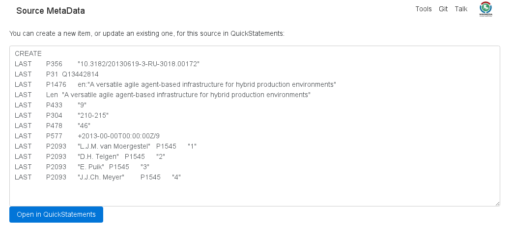

Literatuur over een onderwerp
=============================

In deze opdracht gaan we aan de slag met Open Data. Meer specifiek, we gaan aan de slag
met de annotatie van Open Data met literatuur die het experiment of studie beschrijft die
een feit ondersteund.

Nieuwe artikelen toevoegen aan Wikidata
-----------------------------------

Als je nou literatuur aan Wikidata wil toevoegen, omdat die een auteur heeft van jouw instituut (vorige
opdracht), of omdat je die als bronvermelding wil gebruiken voor een feit in Wikidata, dan kan je die
toevoegen met de [SourceMD](https://tools.wmflabs.org/sourcemd/) tool. Je moet dan wel al een Wikidata
account hebben, en SourceMd toestemming geven edits te maken. SourceMD zelf maakt weer gebruik van een
andere Wikidata tool, met de naam [QuickStatements](https://tools.wmflabs.org/quickstatements/), die ook
toestemming nodig heeft.

**Stap 1**: het artikel toevoegen

Op de SourceMD pagina kan je de [DOI](https://en.wikipedia.org/wiki/Digital_object_identifier) van het artikel invullen:

Daarna maakt SourceMD "quick statements" aan die je aan de QuickStatement tool kan doorgeven:

Door die vervolgens uit te voeren, krijg je een nieuw item in Wikidata voor het digitale object:

IMAGE_TBD

**Stap 2**: informatie over de auteur

TBD

Bronvermeldingen
------------------

Het tweede stuk is het delen van kennis. In tijden dat feiten belangrijker zijn dan ooit, is het zaak te weten
waar die feit vandaan komt: bronvermeldingen. Wikidata heeft hier een rijk mechanisme voor, en elke
"statement" kan onderbouwd worden met een of meer bronvermeldingen. En voor, bijvoorbeeld, fysisch-chemische
eigenschappen kunnen er ook gewoon meerdere metingen weergegeven worden:

....
