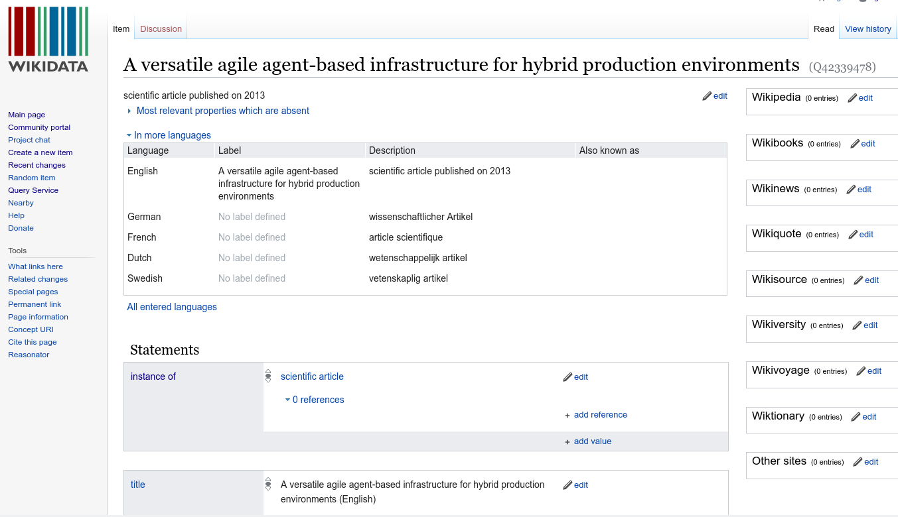

Literatuurbronnen
=================

Uiteraard willen we weten waar onze informatie vandaan komt. Of anders gezegd, waar we meer informatie kunnen vinden.
Hier zijn bronnenlijsten voor, en op (Engelstalige) Wikipedia zien die er zo uit:

Informatie in Wikidata heeft ook literatuurbronnen. Maar anders dan op Wikipedia, zijn de literatuurbronnen
in Wikidata direct gekoppeld aan het genoemde feit. Zoals we hier voor fysisch-chemische eigenshappen
van [azijnzuur](https://tools.wmflabs.org/scholia/topic/Q47512) zien:

In deze opdracht gaan we aan de slag met Open Data. Meer specifiek, we gaan aan de slag
met de annotatie van Open Data met literatuur die het experiment of studie beschrijft die
een feit ondersteund.

## Bronnen in Wikidata

Als we naar de Wikidata pagina van azijnzuur zelf kijken, zien we ook daar de bronvermelding
voor eigenschappen, zoals hier het smeltpunt:

Wie zien hierin twee soorten bronnen:

1. de eerste is een website ("reference URL")
2. de tweede verwijzen naar een bron dat zelf een item in Wikidata is ("stated in")

Het onderwerp van die tweede verwijzing kan dus vanalles zijn, maar is meestel een
wetenschappelijk artikel, een boek (zoals de twee CRC boeken voor de smeltpunten),
of een data set of database.

## Nieuwe bronnen toevoegen aan Wikidata

Omdat artikelen en boeken dus zelf in Wikidata moeten staan, zal je die eerst als bron
moeten toevoegen. Dat is in Wikipedia overigens ook zo, maar daar werkt dat anders.

Boeken moeten met de hand toegevoegd worden, maar wetenschappelijke artikelen kunnen
gelukkig automatisch toegevoegd worden. Nou ja, als je de "digital object identifier" (DOI)
van het artikel hebt. Hoe je die dan toevoegt staat in het volgende stukje.

### Nieuwe wetenschappelijke artikelen

Als je nou literatuur aan Wikidata wil toevoegen, omdat die een auteur heeft van jouw instituut (vorige
opdracht), of omdat je die als bronvermelding wil gebruiken voor een feit in Wikidata, dan kan je die
toevoegen met de [SourceMD](https://tools.wmflabs.org/sourcemd/) tool. Je moet dan wel al een Wikidata
account hebben, en SourceMd toestemming geven edits te maken. SourceMD zelf maakt weer gebruik van een
andere Wikidata tool, met de naam [QuickStatements](https://tools.wmflabs.org/quickstatements/), die ook
toestemming nodig heeft.

**Stap 1**: het artikel toevoegen

Op de SourceMD pagina kan je de [DOI](https://en.wikipedia.org/wiki/Digital_object_identifier) van het artikel invullen:

Daarna maakt SourceMD "quick statements" aan die je aan de QuickStatement tool kan doorgeven:

Door die vervolgens uit te voeren, krijg je een nieuw item in Wikidata voor het digitale object:

# Bronvermeldingen toevoegen aan feiten

Als je bron dan in Wikidata staat, kan je die gebruiken om een referentie toe te voegen.
Zoek hiervoor het feit op waarvoor je een referentie wil toevoegen, en klik dan de
"add reference" link, zoals hier terug te vinden is:

Schroom niet om dit gewoon te proberen, want je kan je fout altijd herstellen.

