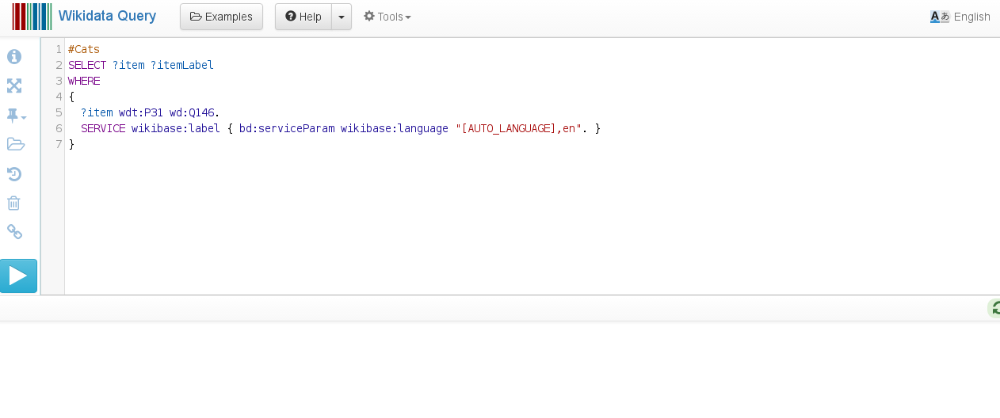

Informatie zoeken in Wikidata
=============================

In deze opdracht gaan we aan de slag met SPARQL. Dat klinkt technisch, en is het ook, maar zo krachtig
dat het de moeite meer dan waard is daar ervaring me op te doen. Al is het alleen maar om te weten wat
het kan. We gaan een aantal voorbeeld doorlopen en knippen en plakken van SPARQL zoekopdrachten is 
absoluut toegestaan. Sterker nog, is verdient de voorkeur boven het "wiel op nieuw uitvinden".

1 Katten
--------

Deze eerste opdracht laat je kennis maken met een van de manieren om informatie te zoeken in Wikidata.
Natuurlijk kan dat ook met de [Wikidata homepage](http://wikidata.org/) zelf ook, maar met de 
[Wikidata Query Service](https://query.wikidata.org/) (WQS) kunnen we de betekenis van dingen gebruiken.
Het eerste voorbeeld is zoeken op alle dingen die een kat zijn. Die SPARQL zoekopdracht daarvoor
hoeven we niet zelf te verzinnen, maar is een voorbeeld uit meer dan 300 voorbeelden die de WQS
standaard aanbiedt onder de "Example" knop:

Als we hier de 'Cats' voorbeeld kiezen, krijgen we de bijbehorende zoekopdracht te zien:

