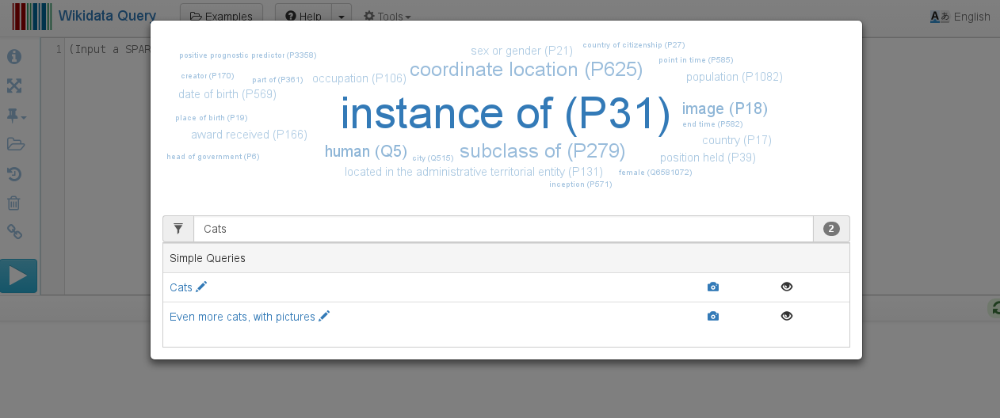
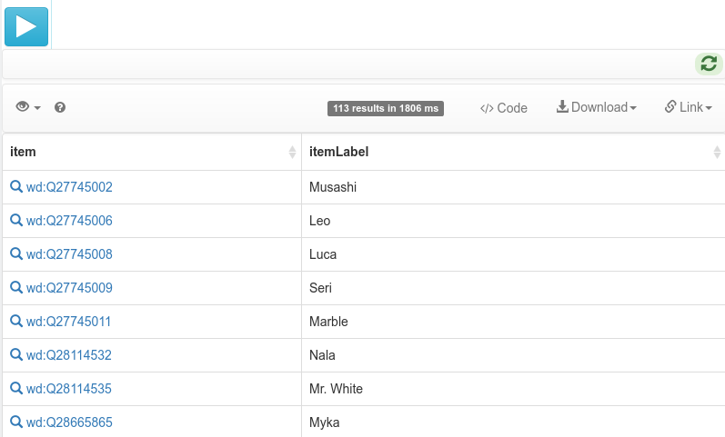

Informatie zoeken in Wikidata
=============================

In deze opdracht gaan we aan de slag met SPARQL. Dat klinkt technisch, en is het ook, maar zo krachtig
dat het de moeite meer dan waard is daar ervaring me op te doen. Al is het alleen maar om te weten wat
het kan. We gaan een aantal voorbeeld doorlopen en knippen en plakken van SPARQL zoekopdrachten is 
absoluut toegestaan. Sterker nog, is verdient de voorkeur boven het "wiel op nieuw uitvinden".

1 Een eenvoudige zoekopdracht: Katten
-------------------------------------

Deze eerste opdracht laat je kennis maken met een van de manieren om informatie te zoeken in Wikidata.
Natuurlijk kan dat ook met de [Wikidata homepage](http://wikidata.org/) zelf ook, maar met de 
[Wikidata Query Service](https://query.wikidata.org/) (WQS) kunnen we de betekenis van dingen gebruiken.
Het eerste voorbeeld is zoeken op alle dingen die een kat zijn. Die SPARQL zoekopdracht daarvoor
hoeven we niet zelf te verzinnen, maar is een voorbeeld uit meer dan 300 voorbeelden die de WQS
standaard aanbiedt onder de "Example" knop:



Als we hier de 'Cats' voorbeeld kiezen, krijgen we de bijbehorende zoekopdracht te zien:


Je kan [die zoekopdracht](https://query.wikidata.org/#%23Cats%0ASELECT%20%3Fitem%20%3FitemLabel%20%0AWHERE%20%0A%7B%0A%20%20%3Fitem%20wdt%3AP31%20wd%3AQ146.%0A%20%20SERVICE%20wikibase%3Alabel%20%7B%20bd%3AserviceParam%20wikibase%3Alanguage%20%22%5BAUTO_LANGUAGE%5D%2Cen%22.%20%7D%0A%7D)
uitvoeren door op de blauwe ''play'' knop to clicken met dit als resultaat:



Deze zoekopdracht heeft een vaste structuur, die er in grote lijnen uitziet als:

```(SPARQL)
SELECT ?onbekende WHERE {
  # voorwaarden
}
```

We zien hier twee delen: ``SELECT`` en ``WHERE``. Het ``SELECT`` deel zegt hoe we de informatie willen zien, en het
``WHERE`` vertelt ons welke informatie we willen zien. Dat laatste is belangrijk, wat we willen niet alles zien,
maar alleen datgene dat aan onze zoekopdracht voldoet.

Bij de zoekopdracht naar katten, willen we weten welk ding (''item'') in Wikidata een kat is, en wat de
naam (''itemLabel'') van die kat is. De zoekopdracht stelt dat we alleen dingen willen die ''kat zijn''.
De ''zijn'' in die opdracht is the ''wdt:P31'' ([P31](https://www.wikidata.org/wiki/Property:P31) is
''instance of'', ofwel ''van het type''). De ''kat''
in die opdracht is [Q146](https://www.wikidata.org/wiki/Q146). De zoekopdracht is dus vooral:

```(SPARQL)
?item wdt:P31 wd:Q146
````

Dit leest als: alle items (''?item'') die ''van het type'' ''kat''.

En omdat Wikidata een internationale database is, gebruiken we verder nog een ''SERVICE'' om een label in
onze (zoals ingesteld in je webbrowser) taal te geven.

Dat maakt de volledige zoekopdracht in de SPARQL zoektaal:

```(SPARQL)
#Cats
SELECT ?item ?itemLabel 
WHERE 
{
  ?item wdt:P31 wd:Q146.
  SERVICE wikibase:label { bd:serviceParam wikibase:language "[AUTO_LANGUAGE],en". }
}
```

2 Boeken van voor 1900 door auteurs die in Nederland geboren zijn
-----------------------------------------------------------------

De zoekopdrachten kunnen veel meer. Bijvoorbeeld, we kunnen zoeken naar boeken die voor 1900 gepubliceerd
zijn en geschreven zijn door schrijvers die in Nederland geboren zijn:


Maar dat zijn wel heel veel stappen in een keer. We doen het step voor stap en beginnen met de zoekopdracht.
We willen dus alleen dingen die een boek zijn ([Q571](https://www.wikidata.org/wiki/Q571)). Dus we maken
een ''variabele'' en gebruiken net zoals bij de katten P31:

```(SPARQL)
?book wdt:P31 wd:Q571
```

Dit leest dus als: alle boeken (''?book'') die ''van het type'' ''boek'' zijn.

Maar we willen meer van het boek weten, zoals de auteur:

```(SPARQL)
?book wdt:P50 ?author
```

We willen ook weten wanneer het boek gepubliceerd is:

```(SPARQL)
?book wdt:P577 ?date
```

Bovendien moet de auteur in een plaats (P19 is ''geboorteplaats'')
in Nederland (Q55) (P17 is ''land'') geboren zijn:

```(SPARQL)
?author  wdt:P19 ?birthPlace .
?birthPlace wdt:P17 wd:Q55 .
```

... MORE TODO ...


